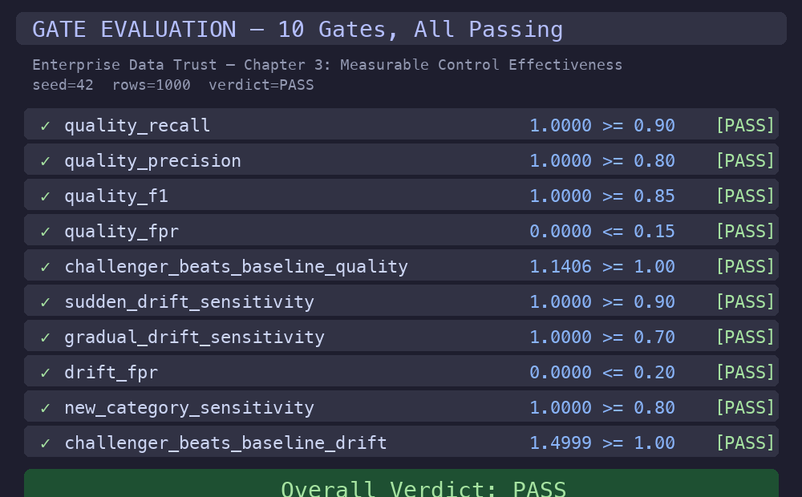
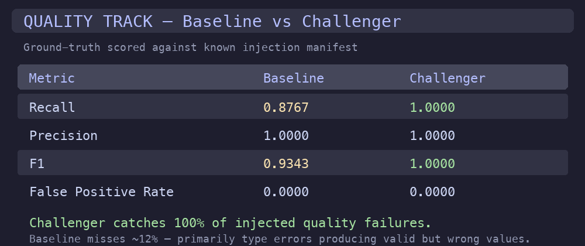
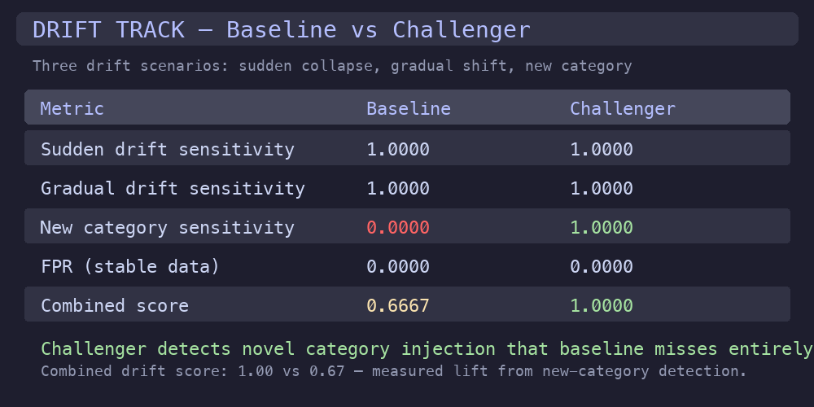

# How Do You Know Your Data Controls Actually Work?

**Enterprise Data Trust — Chapter 3: Measurable Control Effectiveness**

Built by Anthony Johnson | EthereaLogic LLC

---

> If this pattern is useful to your team, consider [starring the repo](https://github.com/Org-EthereaLogic/measurable-control-effectiveness) — it helps others in the Databricks community find it.

---

Every enterprise data platform includes some form of data quality monitoring. Few organizations can answer a direct question from the CFO: what percentage of failures would your controls actually catch?

This chapter demonstrates a measurable way to show how often data controls catch known failure scenarios, and where they outperform standard approaches under the same test conditions.

That turns a budget and governance debate into an evidence-based decision: not "we have controls," but "here is the measured proof of what they catch, miss, and improve."

## Executive Summary

| Leadership question | Answer |
| ------------------- | ------ |
| What business risk does this address? | Organizations invest in data quality tooling without measurable evidence of its effectiveness. When a failure reaches production, there is no way to determine whether the controls were inadequate or simply misconfigured. |
| What does this chapter prove? | A dual-track benchmark that injects known quality and drift failures, runs both a custom approach and an industry-standard alternative against them, and produces ground-truth-scored evidence across 10 configured gates. |
| Why does it matter? | Technology leaders making tooling investment decisions need detection rates, not feature lists. This benchmark provides the measurable evidence that those decisions require. |

## Key Exhibits

### Exhibit 1: All 10 Gates Passing

The benchmark evaluates 10 configured gates covering quality detection, drift sensitivity, false positive rates, and baseline-vs-challenger comparison. Every gate clears its threshold.

<p align="center">
  
</p>

### Exhibit 2: Quality Detection — Baseline vs Challenger

The challenger catches 100% of injected quality failures with perfect precision. The industry-standard baseline misses approximately 12% — primarily type errors that produce syntactically valid but semantically wrong values.

<p align="center">
  
</p>

### Exhibit 3: Drift Detection — Baseline vs Challenger

The challenger detects all three drift scenarios including novel category injection that the proportion-based baseline misses entirely. Combined drift score: 1.00 vs 0.67.

<p align="center">
  
</p>

## The Business Problem

Most enterprise data quality strategies share a common blind spot: they cannot prove their own effectiveness.

- **Investment decisions lack evidence.** When the CTO asks whether the team should invest in better data quality tooling, the answer is usually qualitative rather than quantitative.
- **Control gaps are invisible.** A monitoring tool that catches 80% of quality failures appears to be working well — until the 20% it misses includes the one that corrupts a board-level KPI.
- **Vendor comparisons are subjective.** Teams evaluate vendors based on feature lists and demos rather than measured detection rates against their own failure patterns.

## What This Repository Proves

| Verified outcome | Evidence from this repository |
| ---------------- | ----------------------------- |
| Quality recall is measurable | Challenger achieves 1.0 recall vs baseline 0.8767 on identical injected failures |
| Drift detection gaps are quantifiable | Baseline misses new-category injection entirely (0.0); challenger catches it (1.0) |
| Comparison is fair and reproducible | Both approaches run against the same deterministic seed, same injection manifest, same gate thresholds |
| Evidence is structured for audit | JSON evidence bundle with quality scores, drift scores, gate verdicts, and metadata |

## Decision / KPI Contract

**Business decision:** are the data controls effective enough to trust in production?

| KPI | Meaning |
| --- | ------- |
| `quality_recall` | Percentage of injected quality failures the control actually caught |
| `quality_precision` | Percentage of flagged rows that were real failures (not false alarms) |
| `quality_f1` | Balanced measure of detection accuracy |
| `drift_combined_score` | Aggregate drift detection effectiveness across 3 scenarios |
| `challenger_beats_baseline_quality` | Ratio of challenger recall to baseline recall (must be >= 1.0) |
| `challenger_beats_baseline_drift` | Ratio of challenger combined drift score to baseline (must be >= 1.0) |

**Control rule:** the benchmark passes only when all 10 gates clear — including the two "beats baseline" gates that require the custom approach to match or exceed the industry-standard alternative on both tracks.

## Why This Pattern

- **Gap 1.** Ground truth must replace heuristics. Every injected fault is tracked to exact row indices. Scoring uses the injection manifest as truth, not statistical approximations or threshold tuning.
- **Gap 2.** Dual-track comparison must be built in. The same failures are run through both a baseline and a challenger approach. The benchmark measures exactly where and by how much the challenger outperforms.
- **Gap 3.** Evidence must be structured and auditable. Every run produces a JSON evidence bundle with quality scores, drift scores, gate verdicts, and metadata — the artifact a governance team reviews.

## How It Works

1. **Synthetic data generation.** Deterministic datasets with controlled fault and drift injection (4 quality fault types, 3 drift scenarios).
2. **Baseline evaluation.** Industry-standard quality and drift detection runs against the injected failures.
3. **Challenger evaluation.** Custom distribution-aware approach runs against the same failures.
4. **Ground-truth scoring.** Both sets of results are compared against the known injection manifest.
5. **Gate evaluation.** 10 configured thresholds emit pass/warn/fail verdicts with measured values.

For the benchmark architecture, fault injection specifications, and scoring methodology, see [docs/technical-approach.md](docs/technical-approach.md).

## Databricks Fit

- **Quality gates** map to the Bronze-to-Silver boundary in a Medallion Architecture, where incoming data is validated before promotion.
- **Drift gates** map to the Silver-to-Gold boundary, where business signal stability is verified before executive publication.
- **Evidence bundles** provide governance and audit documentation compatible with Unity Catalog lineage.
- **Deterministic benchmarking** enables reproducible control validation on any Databricks compute tier.
- The benchmark runs locally in pure Python with no infrastructure required — making it accessible for evaluation before platform deployment.

## Portfolio Install Order

Install Chapter One first. `trusted-source-intake` is the canonical home of the
portfolio launcher:

- `Open Executive Demo.command`
- `scripts/executive_mode.py`
- `docs/executive_mode.md`

For the launcher to discover this chapter automatically, clone
`measurable-control-effectiveness` into the same parent directory as
`trusted-source-intake`.

## Reproducibility

Use Python 3.10 or newer.

```bash
git clone https://github.com/Org-EthereaLogic/measurable-control-effectiveness.git
cd measurable-control-effectiveness

python3 -m venv .venv && source .venv/bin/activate
python -m pip install --upgrade pip setuptools wheel
pip install -e ".[dev]"
pytest tests/ -q                            # Expected: 37 passed
benchmark-demo --seed 42 --rows 1000        # Expected: PASS
```

Generate an evidence bundle:

```bash
benchmark-demo --seed 42 --rows 1000 --evidence-dir runs/
```

## Evidence Appendix

| Evidence item | What it shows |
| ------------- | ------------- |
| Quality recall: 1.0000 vs 0.8767 | Challenger catches every injected quality failure; baseline misses ~12% |
| Quality precision: 1.0000 (both) | Neither approach produces false alarms |
| Drift combined: 1.0000 vs 0.6667 | Challenger detects all 3 drift scenarios; baseline misses new-category injection |
| 10 gates: all PASS | Every configured threshold cleared with measured values recorded |

## Scope Boundary

This validates control effectiveness using deterministic synthetic data with a fixed seed (`seed=42`, `rows=1000`). It does not constitute production-data validation, vendor certification, or universal superiority claims. The benchmark measures detection rates on the specific fault types and drift scenarios implemented in the checked-in code.

## Engineering Signals

- GitHub Actions workflow: [ci.yml](https://github.com/Org-EthereaLogic/measurable-control-effectiveness/actions/workflows/ci.yml)

## Additional Documentation

- [Technical approach, fault injection, and scoring methodology](docs/technical-approach.md)

## Part of a Series

This is **Chapter 3** of the *Enterprise Data Trust* portfolio — a three-part body of work addressing the full lifecycle of data reliability in enterprise Databricks platforms.

Install Chapter One first if you want the guided portfolio launcher. This
chapter is designed to run as a sibling repository beside `trusted-source-intake`.

| Chapter | Focus | Repository |
| ------- | ----- | ---------- |
| 1. Trusted Source Intake | Validate and certify data before downstream consumption | [trusted-source-intake](https://github.com/Org-EthereaLogic/trusted-source-intake) |
| 2. Silent Failure Prevention | Detect distribution drift before it reaches executive dashboards | [silent-failure-prevention](https://github.com/Org-EthereaLogic/silent-failure-prevention) |
| **3. Measurable Control Effectiveness** | Prove that your data controls work against known failure scenarios | ← You are here |

MIT License. See [LICENSE](LICENSE.md) for details.
